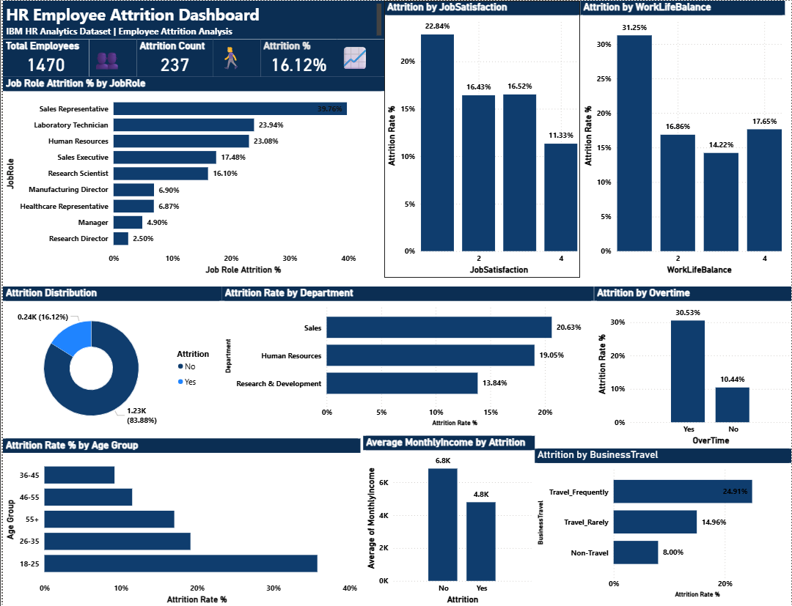

# HR Employee Attrition Analysis

## Project Overview

This project analyzes employee attrition using the IBM HR Analytics dataset. The objective is to identify the key factors driving employee turnover and provide data-driven recommendations to improve employee retention.

The analysis combines SQL, Python, SQLite, and Power BI to uncover business insights, identify high-risk employee groups, and visualize attrition patterns through an interactive dashboard.

---

## Dashboard Preview


---

## Business Objective

The goal of this project is to answer important HR questions such as:

* Which employees are most likely to leave?
* Which departments and job roles experience the highest attrition?
* How do overtime, salary, work-life balance, and business travel affect attrition?
* Can employees at high risk of leaving be identified early?

The findings can help HR teams make better retention decisions and reduce employee turnover.

---

## Dataset Information

**Dataset:** IBM HR Analytics Employee Attrition Dataset (Kaggle)

* Total Employees: 1,470
* Features: 35 HR-related variables
* Removed Columns: EmployeeCount, StandardHours, Over18
* Missing Values: None

---

## Tools & Technologies

* Python
* SQLite
* SQL
* Pandas
* Matplotlib
* Seaborn
* Jupyter Notebook
* Power BI

---

## Project Workflow

### 1. Data Preparation

* Loaded dataset into Python
* Removed unnecessary columns
* Created SQLite database
* Executed SQL queries for analysis

### 2. Exploratory Data Analysis

* Company-wide attrition analysis
* Department analysis
* Job role analysis
* Demographic analysis
* Salary analysis
* Work factor analysis

### 3. Risk Scoring

Built a simple employee risk scoring model to classify employees into:

* Low Risk
* Medium Risk
* High Risk

### 4. Dashboard Development

Created an interactive Power BI dashboard to visualize:

* Employee Overview
* Attrition Distribution
* Department Attrition
* Job Role Attrition
* Overtime Impact
* Work-Life Balance Analysis
* Salary Analysis
* Business Travel Analysis

---

## Repository Structure

```text
HR-Employee-Attrition-Analysis/
│
├── hr_analysis_final.ipynb
├── hr_database.csv
├── hr_attrition_dashboard.pbix
├── hr_attrition_dashboard.png
├── README.md
```

---

## Key Findings

* Overall attrition rate is **16.12%** (approximately 1 in every 6 employees leaves the company)
* **Sales Representatives** have the highest attrition rate at **39.76%**
* Employees aged **18–25** show the highest attrition rate at **37.84%**
* Employees working **overtime** leave at **30.53%**, compared to **10.44%** for non-overtime employees
* Employees with poor **work-life balance** leave at significantly higher rates
* Employees earning **below 3000 monthly income** show attrition rates close to **30%**
* **Single employees** have higher attrition than married employees
* Most attrition occurs during the **first two years** of employment

---

## Employee Risk Scoring Results

Employees were categorized into three risk levels:

| Risk Level  | Employee Count | Actual Attrition Rate |
| ----------- | -------------- | --------------------- |
| Low Risk    | 574            | 5.1%                  |
| Medium Risk | 589            | 12.4%                 |
| High Risk   | 307            | 44.0%                 |

The risk scoring model successfully identifies employee groups with substantially higher attrition risk.

---

## Recommendations

1. Review overtime policies since overtime is the strongest attrition driver.
2. Create retention programs for employees in their first two years.
3. Improve compensation for lower-income employee groups.
4. Focus HR retention efforts on Sales-related roles.
5. Reduce excessive business travel where possible.
6. Improve work-life balance initiatives for high-risk employees.
7. Monitor young employees (18–25 age group) more closely.

---

## Project Summary

Analyzed 1,470 IBM employee records using SQL, Python, SQLite, and Power BI to identify the key drivers of employee attrition.

The analysis revealed that overtime, low salary, poor work-life balance, young age, and Sales-related roles are the strongest predictors of employee turnover. A risk scoring model was also developed to identify employees who are most likely to leave, enabling proactive retention strategies.

---

## Author

Vipin Pandey
MCA (Data Science)
UPES Dehradun

LinkedIn: https://linkedin.com/in/vipin-pandey-21810328a

GitHub: https://github.com/vipinpandey789
